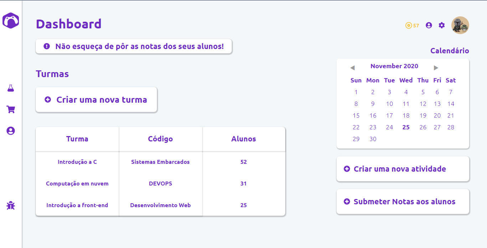

<h1 align='center'>Página Dashboard</h1>

<h3>🔖 Descrição</h3>

Projeto desenvolvido para teste de vaga frontend

<h3>🚀 Tecnologias</h3>
<ul>
    <li><h4>React</h4></li>
    <li><h4>React Route</h4></li>
    <li><h4>JavaScript</h4></li>
    <li><h4>CSS</h4></li>
</ul>

<h3>ℹ️ Como usar</h3>

    # Clone esse repositório
    $ git clone https://github.com/juvenalbruno/Dashboard.git
    
    # Instalar dependências do projeto
    $ npm install
    
    # Executar o comando para rodar o projeto web
    $ npm start

<h3>🖼 Layout</h3>
<h4>Dashboard</h4>

